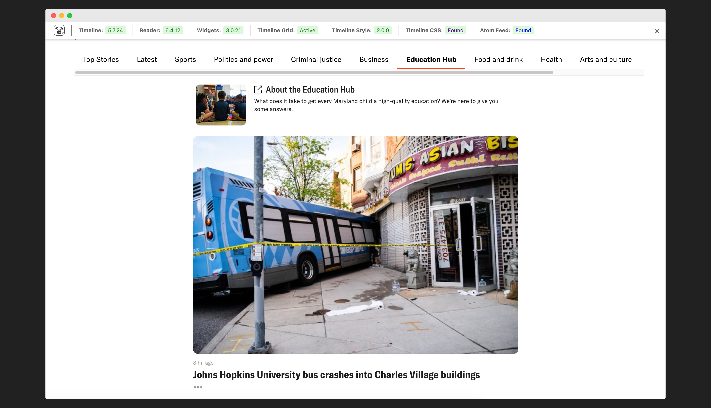

# Pugpeep Extension

A Chrome extension that provides information about Pugpig Bolt components and their versions on reader pages.

## Features

The extension displays a help bar at the top of the page showing the status of various Pugpig Bolt components:

- **Timeline**: Shows the version of the timeline component
- **Reader**: Displays the Bolt Reader version
- **Widgets**: Indicates the version of custom widgets
- **Timeline CSS**: Shows whether the custom timeline stylesheet is present
- **Timeline Grid**: Indicates if the timeline grid feature is active
- **Timeline Style**: Shows the version of the timeline style
- **Atom Feed**: Displays whether the Pugpig Atom feed is accessible

## Installation

1. Clone this repository
2. Open Chrome and navigate to `chrome://extensions/`
3. Enable "Developer mode" in the top right
4. Click "Load unpacked" and select the extension directory

## Usage

1. Navigate to any Pugpig Bolt reader page
2. Click the Pugpeep extension icon in your browser toolbar
3. The help bar will appear at the top of the page showing component statuses only if Bolt Reader is present
4. Click the × button to hide the help bar

## Requirements

- Google Chrome browser
- Access to Pugpig Bolt reader pages

## Development

The extension is built using:
- Chrome Extension Manifest V3
- Vanilla JavaScript
- CSS for styling